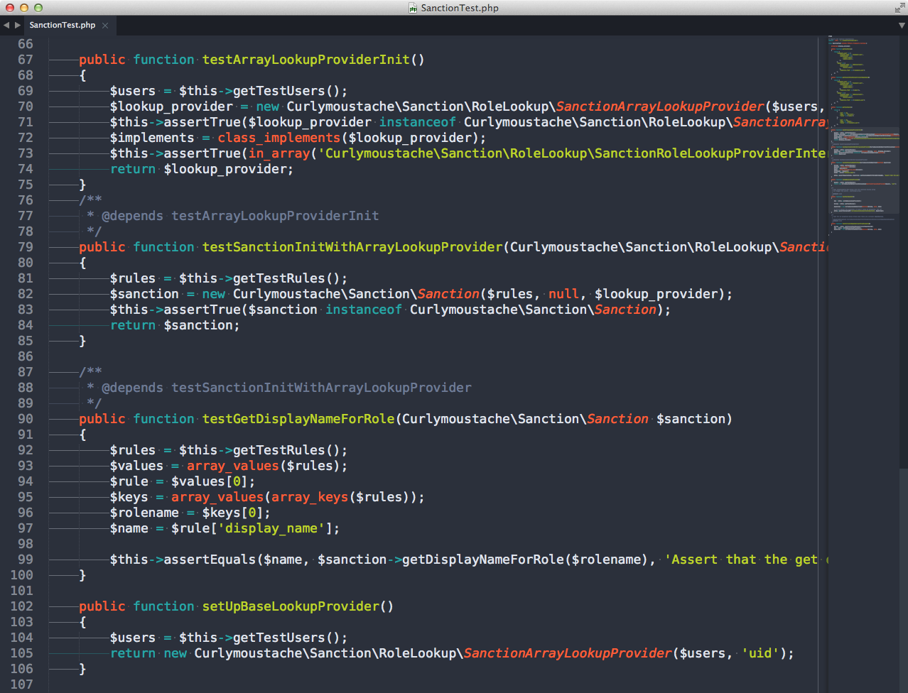
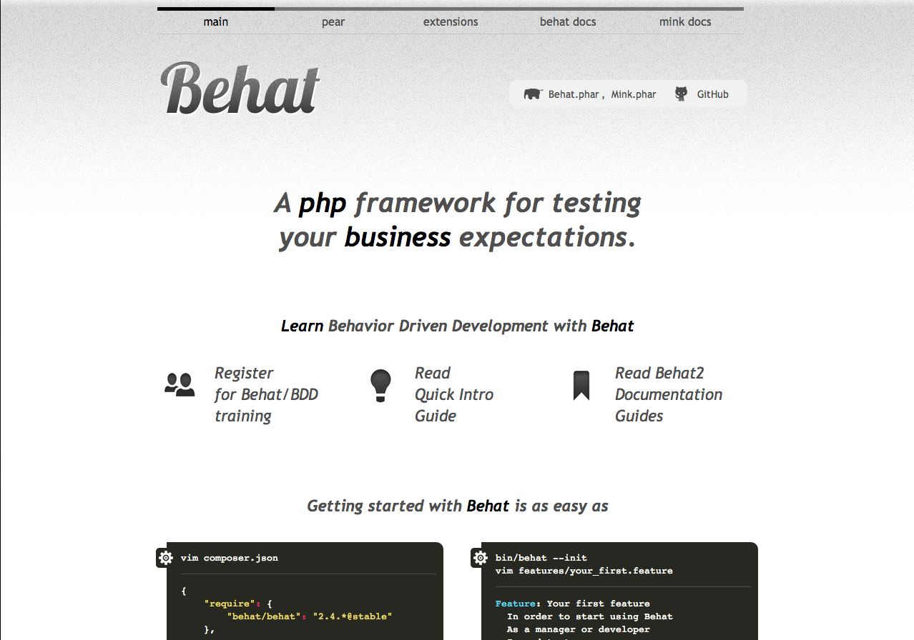
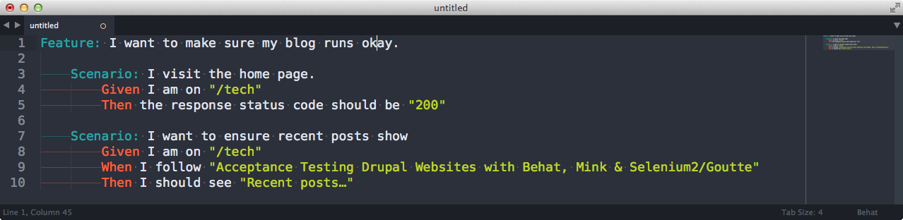
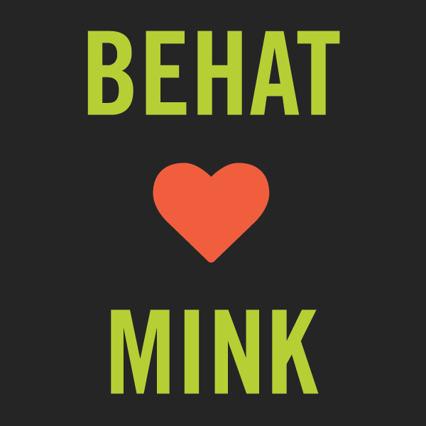
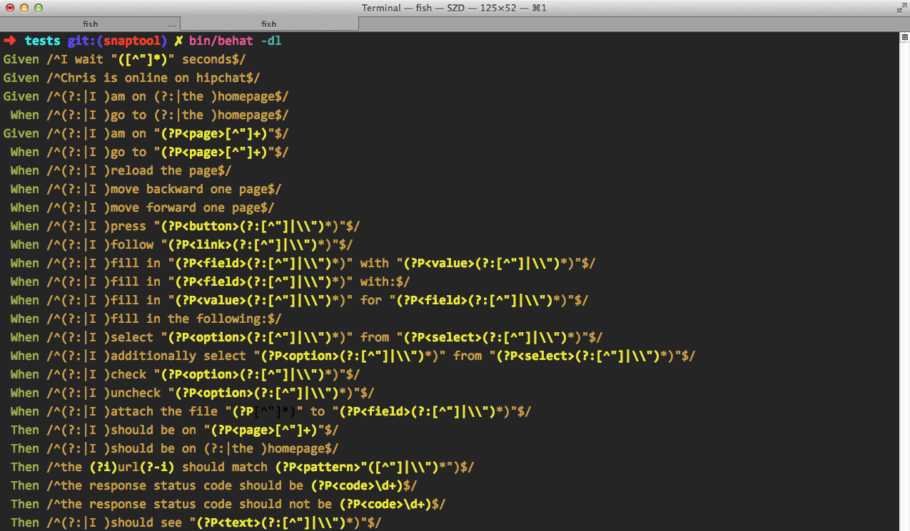
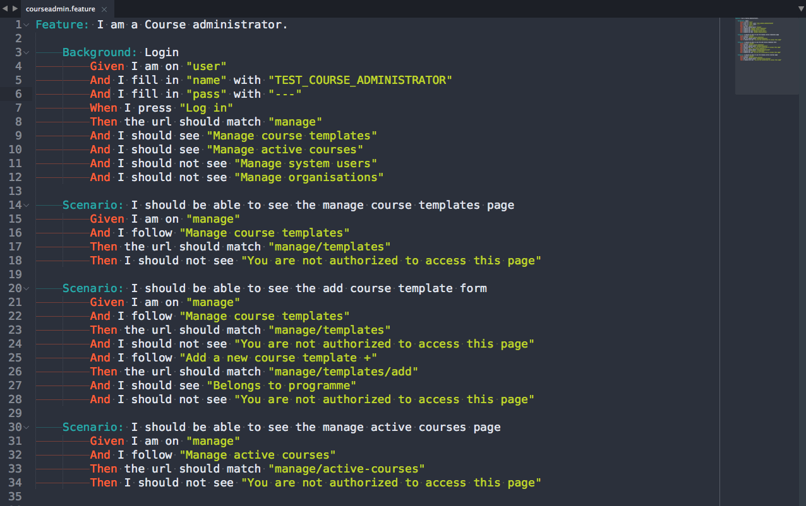
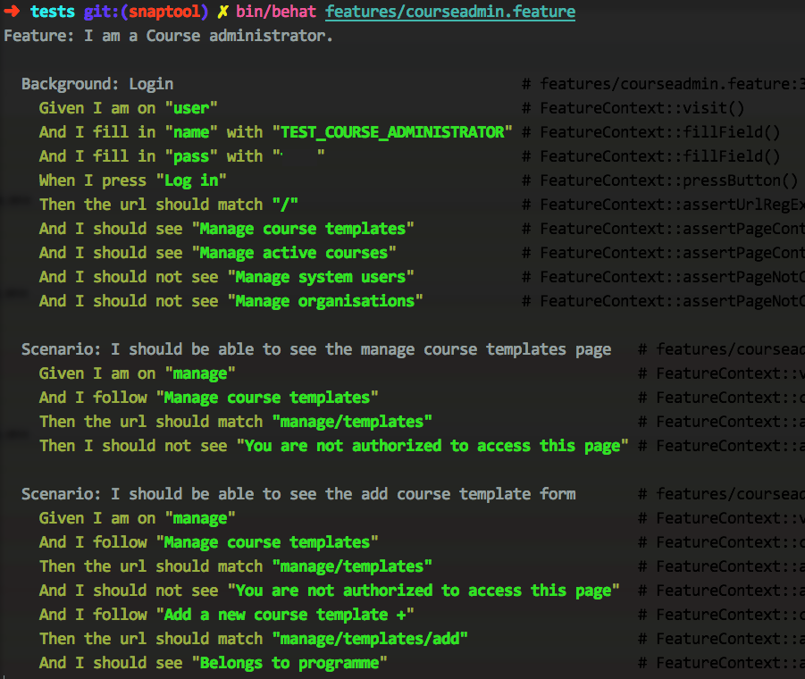

# Acceptance testing your sites with Behat.

!SLIDE
# Acceptance testing your sites with Behat.

!SLIDE

## About Me

}}} images/me.jpg

- Web Developer at Hydrant for ~3 years.
- UoC Alumni (Don't ask).
- Cyclist and West Cumbrian.

!SLIDE
## I'm here to talk to you about acceptance testing.

!SLIDE

#### Acceptance testing is a test conducted to determine **if the requirements of a specification or contract are met**.

!SLIDE
It's essentially your proof to the client or customer that you're **delivering what was agreed…**

!SLIDE
### But it's *so much more than that*

Acceptance testing, in my opinion, is much more useful than unit testing your code **in certain situations**.

!SLIDE

### Testing normally looks like this.

`https://github.com/danmatthews/sanction-php/blob/develop/tests/SanctionTest.php`

!SLIDE

### Say Hello to Behat.

Your new best friend.

!SLIDE

!SLIDE

!SLIDE solarized

### Write fluent, readable tests.

Using `.feature` files.

!SLIDE

### Mink

Mink is an acceptance testing plugin for Behat.

Mink provides the bridge between Behat and Browser emulators like **Selenium2**.

!SLIDE

### Mink gives you these lovely helpers...

You can use these in your `.feature` files.

!SLIDE

## Writing feature files (tests)

Features start lines with the keywords:

- *Given* `<a condition>`
- *When* `<an action>`
- *Then* `<an action|assertion>`
- *But* `<a condition?>`
- *And* `<an action|assertion>`

"Behat treats them all the same, but you shouldn’t."

!SLIDE
### Feature example: `courseadmin.feature`

!SLIDE

These are essentially *user journeys* with technical assertions thrown in.

!SLIDE

### Running the tests

